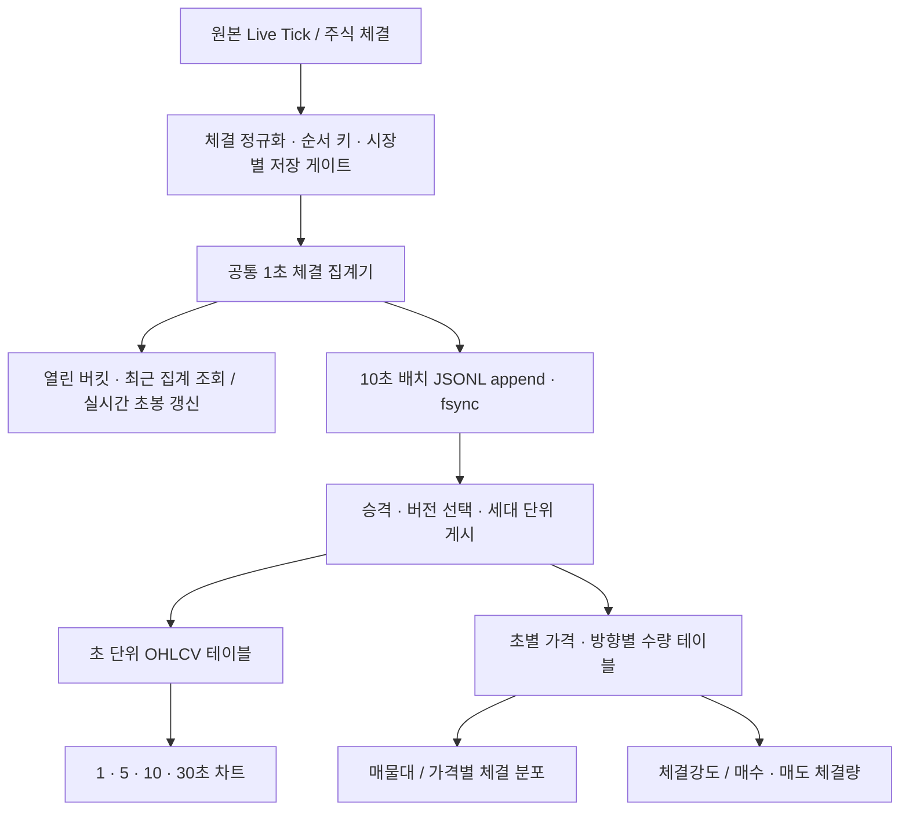

# 초 단위 체결 집계와 초봉·매물대 공통 데이터 계획

작성: 2026-09-30
상태: 설계 검토안. 구현·운영 서버 변경·데이터 이관은 아직 수행하지 않았다.

## 1. 결론

원본 Live Tick에서 **공통 1초 체결 집계**를 만들고, 초봉·매물대·체결강도가 이를
각각 조회하는 구조를 도입한다. 공통 집계는 OHLCV뿐 아니라 가격별·체결 방향별
수량을 함께 보존한다. 매물대를 캔들의 OHLCV에서 역산하지 않는다.

1초는 분석 단위이며 디스크 쓰기 주기가 아니다. 초봉 표시는 별도 갱신 경로로
제공하고, 저장은 현재 10초 배치 쓰기 구조를 활용한다. 원본 틱을 전량 영구 저장하는
설계는 이번 범위에 넣지 않는다. 정확성의 범위는 **관측한 체결**이며, 공급자 또는
연결에서 소실된 체결을 초봉이 복원할 수 있다고 주장하지 않는다.

새 집계를 기존 경로 옆에 추가하고 결과를 비교한 뒤 소비자를 단계적으로 전환한다.
현재 과거 분봉과 10초 체결 데이터는 유지하며, 초 단위 정확도가 없는 구간을
가짜 초봉으로 채우지 않는다.

### 대안 비교

| 대안 | 장점 | 한계 / 판단 |
|---|---|---|
| 원본 틱 전량 저장 | 체결 순서 재분석·임의 구간 재집계 가능 | 쓰기량·보존 비용 검토가 별도로 필요. 이번에는 채택하지 않음 |
| 1초 OHLCV만 저장 | 초봉 조회가 단순하고 상대적으로 작음 | 가격별 체결 분포를 복원할 수 없어 공통 원천으로 부족 |
| 1초 OHLCV + 가격·방향별 수량 | 초봉·매물대·체결강도의 공통 시간 기준 확보 | 원본 틱 전체 순서와 초 미만 재분석은 보존하지 않음. 채택 |
| 기존 10초 trade에서 초봉 생성 | 새 수집 경로가 필요 없음 | 시가·종가와 1·5초 경계를 복원할 수 없어 채택하지 않음 |

## 2. 확인한 현재 구조

| 구성 | 현재 동작 | 설계에 미치는 영향 |
|---|---|---|
| `hoga/live/kiwoom_frames.py` | 체결 가격·수량·방향·HHMMSS 시각·누적거래량 파싱 | 초 버킷 생성 가능. 같은 초 안의 실제 거래소 순서는 별도 검증 필요 |
| `hoga/live/stream.py` | 원본 틱은 표시 버퍼에 전달하고, 저장 경로는 시장별 게이트 적용 | 공통 집계는 원본 체결 입력에서 생성하고 기존 시장별 게이트를 따른다 |
| `hoga/live/minute_candle_agg.py` | 원본 틱으로 1분봉 생성, 누적거래량 차이 우선 | 초봉 거래량과 기존 분봉 거래량이 자동으로 같다고 가정하면 안 된다 |
| `hoga/live/downsampler.py` | 10초 동안 `(price, side)`별 수량 합산. `side == 0` 제외 | 개별 체결 시각·순서 소실. 초봉 재료로 재사용 불가 |
| `hoga/live/writer.py` | JSONL append, 파일별 직렬화, 배치 fsync | hot path에서 Parquet 직접 쓰기를 추가하지 않는다 |
| `hoga/live/promote.py` | JSONL을 읽어 조회용 Parquet 게시 | 새 집계의 검증·중복 제거·세대 단위 게시가 필요 |
| `hoga/api/bundle.py` | 매물대는 `trades.parquet`; 체결강도는 `fills.parquet` 우선 | 매물대와 체결강도는 독립적으로 전환할 수 있다 |
| `hoga/api/past_indicators_cache.py` | 일부 과거 지표를 1분 단위로 캐시 | 초봉에 기존 1분 캐시를 그대로 쓰면 정보가 소실된다 |
| 프론트 `livePage.ts`, `LiveChartRoot.tsx` | 최저 주기는 1분, 커서·축 표시는 분까지 | 주기 모델·API·축·연동·지표 프로필을 함께 확장해야 한다 |

현재 코드가 우선 근거다. 초기 ADR에 적힌 KRX 전용 조건은 이후 ADR-0140과
시장별 저장 게이트 변경을 함께 읽어 해석한다. 현재 운영 종목 수·디스크 용량·틱
수신 지연 분포는 이 문서에서 실측했다고 주장하지 않는다.

## 3. 데이터 흐름과 모듈 책임

제안 모듈명은 구현 단계에서 확정한다.

- `hoga/live/second_trade_agg.py`: 순수 sync 집계기. 네트워크·디스크 I/O 없음.
  틱당 정규화 후 버킷과 가격 셀을 갱신하며, 전체 이력 스캔을 하지 않는다.
- `hoga/live/stream.py`: 집계 입력 fan-out, 배치 저장, ack/commit, 종료 drain 담당.
- `hoga/live/writer.py`, `promote.py`: JSONL 내 새 종류 및 조회용 산출물 생성.
- 새 초 집계 테이블 모듈: 검증·스키마·재집계 쿼리를 소유한다. 거대한 bundle
  함수 안에 집계 알고리즘을 추가하지 않는다.
- 조회 서비스: 디스크 집계와 아직 게시되지 않은 메모리 집계를 버전 키로 합친다.
  초봉과 매물대가 별개 원본을 계산해 서로 다른 결과를 내지 않도록 한다.

기존 `MinuteCandleAggregator`를 처음부터 교체하지 않는다. 누적거래량 보정 차이를
분석한 뒤, 별도 단계에서 공통 집계 재사용 여부를 결정한다.

## 4. 공통 집계 계약

### 식별과 시간

- 기본 키: `(source, venue, code, trading_date, bucket_start_ms)`.
- `bucket_start_ms = floor(event_time_ms / 1000) * 1000`.
- 버킷은 `[start, start + 1000)` 반열린 구간이다. 다음 초 정각 체결은 다음 버킷이다.
- 저장 시각은 Unix ms이며 거래일 파티션은 기존 시장별 달력·저장 창 규약을 따른다.
- 시장 구분을 가격에서 추정하지 않는다. UN 처리도 현재 프레임 분류 규약을 따르며,
  UN·KRX·NXT를 동시에 합산해 같은 체결을 중복 계산하지 않는다.

### 봉과 가격 분포

| 필드 그룹 | 내용 |
|---|---|
| OHLC | 관측 체결의 첫 가격·최댓값·최솟값·마지막 가격 |
| 순서 경계 | 첫/마지막 `event_time_ms` 및 `ingest_seq` |
| 수량 | `observed_volume`, 관측 체결 건수, 관측 거래대금 |
| 가격 분포 | `price`, `side`별 수량 및 체결 건수 |
| 품질 | 연결 누락/수집 시작·종료의 부분 구간, 지연 체결, 누적값 불연속 여부 |
| 게시 정보 | 스키마 버전, 버킷 revision, 저장 순번 |

시가·종가는 `(event_time_ms, ingest_seq)` 순서로 선택한다. 공급자가 거래소 체결
순번을 제공하지 않는다면 같은 초 안의 순서는 수신 순서라는 한계를 명시한다.
`ingest_seq`는 저장된 경계 키와 충돌하지 않도록 재시작 때 복구한다.
수신 순서를 뒤집지 않도록 활성 종목 필터 이후 첫 await 전에 순서 키를 부여하고,
집계 입력도 그 키를 그대로 사용한다.

동일 시각·가격·수량의 체결도 실제로 여러 번 발생할 수 있다. 이 세 필드의 해시로
중복 제거하지 않는다. 공급자의 신뢰할 수 있는 체결 ID가 확인된 경우에만 해당 ID로
중복 제거하며, 그 외에는 관측한 프레임을 수신한 만큼 처리한다.

### 거래량과 `side == 0`

공통 집계의 `observed_volume`은 **실제 받은 체결 수량의 합**이다.
가격 분포 수량의 합과 항상 같아야 한다. `side == 0`도 삭제하지 않고 별도 방향으로
보존한다. 숫자 0을 동시호가로만 단정하지 않으며, 연속체결/단일가 여부는 기존
시장·세션 판정과 필요한 원천 필드로 구분한다.

누적거래량 차이는 품질 검증 및 별도의 reported-volume 정보로 다룬다. 누락량의
체결 가격을 모르는데 특정 가격 셀에 배분하거나 관측 거래량에 섞지 않는다.
누적거래량이 시장별 값인지 통합 값인지 확인한 뒤 비교한다. 재접속·누적값 리셋·
다중 거래소 중복 구독도 검사한다.

기존 1분봉의 cum-volume 보정값과 합계가 다르면 원인을 분류한다. 동등성 검증은
**같은 관측 틱·같은 세션·같은 방향 필터**에서 수행하며, 비교를 통과시키려고
새 가격 분포의 수량을 임의 보정하지 않는다.

### 재집계 불변식

- 5·10·30초봉: 포함된 1초 버킷의 최초 open, 최후 close, max(high), min(low),
  sum(observed_volume), sum(관측 거래대금).
- 매물대: 선택 구간의 `(price, side)` 수량 합. 가격 bin 계산은 기존 규약 유지.
- 연속체결 매물대·체결강도: 기존 방향·세션 필터를 동일하게 적용한 뒤 합산한다.
- 같은 입력·조회 구간이면 원본 틱 직접 계산 결과와 초 집계 재계산 결과가 같다.
- 가격·거래대금은 정수로 계산한다. 프론트의 JS 안전 정수 범위를 넘는 필드는
  wire 형식과 표시 방법을 API 계약에 명시한다.

## 5. 지연·누락·빈 구간·재시작

### 지연 체결

수신 시각으로 버킷을 정하지 않는다. event time으로 이미 닫힌 버킷에 도착할 수
있으므로 최근 버킷을 제한된 수정 구간으로 보유한다. 최초 후보는 2초 지연 허용,
최근 60초 수정 보유이며, 실제 프레임 추적으로 검증 후 확정한다.

수정은 같은 버킷 키의 revision 증가로 게시한다. 이미 계산한 시가·종가도 순서 키를
비교해 교체한다. 60초보다 오래된 체결은 조용히 폐기하지 않는다. 별도 늦은 이벤트
기록으로 저장해 승격 시 재계산하며, 영향을 받은 구간은 품질 상태에 표시한다.
수정 보유 범위 밖에서는 즉시 화면 수정이 보장되지 않음을 API에 명시한다.

### 거래 없는 초와 수집 공백

- 연결이 정상이고 해당 종목을 수집하는 동안 체결이 없는 초: 봉을 생성하지 않는다.
  필요하면 화면에서 whitespace를 생성하지만 이전 종가의 가짜 체결로 채우지 않는다.
- 연결 끊김·구독 전·구독 해제 후: 수집 공백이다. 무거래로 판정하지 않는다.
- 구독·연결 구간 메타데이터를 저장해 `empty`와 `unavailable/partial`을 구분한다.
- 5·10·30초로 묶은 봉은 구성 구간 중 수집 공백이 있으면 partial 상태를 승계한다.
- 시간 구간 매물대의 cutoff는 `[from, to)`로 정의한다. 과거 조회는 1초 경계만
  정확하게 지원하며, 그보다 작은 시각 정밀도를 반환한다고 주장하지 않는다.

### 저장 실패와 재시작

- 저장 전에 불변 배치 스냅샷을 만든다. append 성공으로 ack한 revision만 commit한다.
  await 동안 들어온 새 틱·수정 revision은 삭제하지 않는다.
- 재시도한 JSONL 레코드는 키·revision으로 멱등 처리한다. append 성공 후 ack 전
  장애로 같은 배치가 다시 기록돼도 승격 결과가 두 배가 되지 않아야 한다.
- ack와 fsync 완료를 구분한다. 디스크 내구성이 확보된 순번을 추적한다.
- 정상 종료: 부분 버킷을 partial로 봉인 → append → fsync → 조회용 게시 순서.
- 비정상 종료: 마지막 내구성 확보 배치 이후 미저장 체결은 복원할 수 없다.
  10초 배치 정상 동작 시 약 10초가 기본 손실 구간이며, 저장 지연·실패 시 더 길 수
  있다. 복구 후 해당 구간을 partial/unavailable로 표시한다.
- 마지막 배치·부분 버킷·revision을 복구한 뒤 새 입력을 받는다. 원본 틱이 없으므로
  누락된 시가·종가를 REST 1분봉으로 만들어 넣지 않는다.

## 6. 저장·조회 설계

### 단일 저장 원본과 두 조회 테이블

JSONL에는 봉과 가격 분포를 포함한 **한 개의 버킷 레코드**를 append한다. 두 내용을
서로 다른 시점에 기록해 봉 거래량과 매물대 수량이 갈라지는 것을 방지한다.

조회용 파일 이름 후보:

- `trade_seconds.parquet`: 초별 OHLCV·순서 경계·품질·revision.
- `trade_second_prices.parquet`: 초별 가격·방향·수량·체결 건수.

현재 venue별 source 디렉터리 아래 별도 초 집계 namespace에 생성한다. 기존
`candles.parquet`에 1초·1분 행을 섞지 않는다. 두 테이블과 coverage metadata는
같은 generation으로 만든 뒤 manifest를 원자 교체해 한 세대로 게시한다. 조회는
manifest가 가리키는 세대만 읽고, 이전 세대는 진행 중인 조회가 끝난 뒤 정리한다.

### 조회 계약

제안: `GET /api/live/second-aggregates`에서 Code·venue·시간 범위·주기
(`1s/5s/10s/30s`)를 받아 OHLCV·coverage·품질 상태를 반환한다. 가격 분포는
별도 서버 쿼리로 합산하며 모든 가격 셀을 차트 브라우저로 전송하지 않는다.

- source 선택은 해당 구간의 **초 집계 커버리지**로 판단한다. 1분 소스의 파일 존재로
  초봉 지원을 판단하지 않는다.
- 새 파일과 아직 게시되지 않은 live 버킷을 같은 키의 최신 revision으로 합친다.
  persisted high-watermark를 단순 시각 한 개로 취급해 누락 종목을 덮지 않는다.
- 매물대는 요청 구간 전체가 새 집계로 커버되면 새 경로를 사용한다. 부족하면 처음에는
  요청 전체를 기존 경로로 처리하고 10초 해상도를 반환한다. 두 경로를 겹쳐 합산하지
  않는다. 날짜별 혼합은 이후 명시적인 구간 분할·중복 제거 계약으로 확장한다.
- 과거 캐시 키에는 source·venue·집계 스키마/정책 버전·데이터 generation·조회 범위를
  포함한다. 오늘의 revision 수정은 관련 결과를 무효화한다.
- 새 JSON API 모델과 프론트 TypeScript 미러를 같은 변경에서 추가한다.
- 기존 `/api/range`의 분봉 whitelist를 무작정 초 단위로 넓히지 않는다. 호가 지표와
  원천이 다른 데이터까지 초 정밀도로 제공되는 것처럼 보일 수 있다.

## 7. 프론트 지원 범위

1. 첫 화면 지원은 주식 10초봉 + 거래량 + 현재 주기 이동평균선으로 제한한다.
2. 검증 후 1·5·30초 선택을 추가한다. 저장 원천은 처음부터 1초다.
3. `SecondTimeframe`과 intraday 분류를 명시한다. 초봉을 `MinuteTimeframe`에 억지로
   넣지 않고, `baseFor`, API 라우팅, 주기별 지표 프로필·창 상태 복원을 점검한다.
4. 시간축·커서·툴팁은 `HH:mm:ss`를 지원한다. Virtual Axis는 기존 초 좌표를 활용하되
   거래일 경계·세션 공백·1초 간격의 중복 좌표를 테스트한다.
5. 창 간 커서 연결, 자동 스크롤, 과거 pan, 저장뷰 주기 검증, 캘린더에서의 점프를
   초봉의 시간 간격과 구분해 연결한다. 기존 ‘분봉으로’ 동작을 암묵적으로 바꾸지 않는다.
6. 호가·거래원·프로그램·투자자 데이터의 원래 관측 주기는 별개다. 초봉과 정밀도가
   다른 지표는 초기에는 제외하거나 관측 주기를 드러낸다. 단순 forward-fill을 실제
   초 단위 관측치로 표시하지 않는다.
7. 대표 지수는 별도 원천 검증 전 제외한다. 기존 주식 체결로 지수 초봉을 합성하지 않는다.

## 8. 성능·보존과 운영 기준

정규장 6시간 30분에 체결이 매초 있다면 종목·시장당 최대 약 23,400개의 1초 봉이
생긴다. 1분봉 대비 최대 약 60배이며 가격 셀 수는 추가로 늘어난다. 이는 산술 상한
예시이고 실제 저장 크기나 운영 부하 측정값은 아니다.

- 가격 셀은 `(second, price, side)`로 즉시 합쳐 틱 전량 목록을 메모리에 쌓지 않는다.
- 봉·가격 셀·수정 버킷·대기 저장 배치의 각각의 행 수와 byte 크기를 측정한다.
- 저장 실패 시 큐를 무제한 늘리지 않는다. 구현 전 메모리 예산과 디스크 부족 정책을
  정하고, 예산 초과 시 새 초 수집을 명시적으로 중단하고 해당 coverage를 기록한다.
  기존 호가·분봉 경로까지 정지시키지 않도록 장애를 격리한다.
- 초기 차트 조회는 최근 30분을 기본으로 하고 pan으로 추가 조회한다. 하루·다일
  데이터를 틱마다 전체 재전송·재투영하지 않는다.
- live publication은 최대 1초 주기로 묶고 열린 봉을 갱신한다. 디스크 배치 주기와
  독립적으로 동작한다. 전체 raw tick 배열을 매번 JSON으로 보내지 않는다.
- 벤치마크 입력: 활발한 주식, 드문 체결 주식, 버스트, 다중 시장, 실제 최대 Live Set.
  집계 처리 시간 p95/p99, 이벤트 루프 지연, RSS, JSONL 쓰기량·fsync 지연, 승격
  시간, 초봉/매물대 쿼리 지연, 프론트 갱신·pan 시간을 측정한다.
- 1초 데이터 보존 기간은 실측 저장 증가량을 보고 확정한다. 보존 정책 확정 전 자동
  삭제는 구현하지 않는다. 추후 10초로 축약할 때도 OHLC와 가격 분포를 함께 유지한다.
- 기본 수집 대상은 기존 Live Set을 따르되, 전 종목 활성화는 부하 검증 후 진행한다.
  화면에 열린 종목만 조용히 저장하는 정책은 도입하지 않는다.

## 9. 단계별 구현 계획

| 단계 | 변경 범위 | 완료 조건 |
|---|---|---|
| P0: 입력·계약 확인 | 시각 해상도, 같은 초 순서, 시장별 누적거래량, 중복 프레임·재접속, 저장량 샘플, ADR 초안 | trace 기반 관측 한계와 지연·메모리 예산 확정 |
| P1: 순수 집계기 | 정규화·순서 키·1초 OHLC·가격 분포·품질·재집계 | 원본 틱 직접 계산과 결과 동등성, 경계/지연 테스트 통과 |
| P2: 내구성·승격 | JSONL 새 종류, ack/revision, 종료·복구, 두 Parquet 및 manifest, coverage | 실패 주입·재시도·반복 승격에서도 중복/혼합 세대 없음 |
| P3: 서버 읽기 | 초봉 API, live/disk 병합, 가격 분포 쿼리, 캐시 키 | 읽기와 수정 경쟁에서도 버전·거래량·coverage 일관 |
| P4: 10초봉 UI | 주기 모델·시간축·거래량·MA·상태 복원·연동 | live/새로고침/과거 pan에서 동일 결과, 의미 있는 E2E 통과 |
| P5: 매물대 전환 | 완전 커버 구간만 새 조회, 기존 폴백 및 해상도 명시 | 동일 필터·구간에서 원본 직접 계산과 일치, 이중 계산 없음 |
| P6: 확대 | 체결강도 전환, 1·5·30초 UI, 기존 1분 합성기 통합 판단 | 전체 Live Set 부하·기존 지표 회귀 검증 후 점진 활성화 |

P1까지는 운영 경로에 연결하지 않는 준비 변경이다. P2/P3는 기능 플래그로 기존
저장·조회와 병행하고, P4부터 사용자 화면에 노출한다. P5 검증이 끝나기 전
기존 10초 trade 산출물을 없애지 않는다. 최종 중복 저장 제거는 별도 변경으로 수행한다.

## 10. 검증 기준

- 같은 초 여러 가격, 같은 가격 반복 체결, 방향 ±1/0, 무거래, 정각 경계,
  주식 코드·venue·거래일 전환, 세션 시작/마감·시간외·거래중단.
- 순서가 뒤바뀐 틱, 동일 초 순서 키, 늦은 수정, 수정 구간 밖 체결,
  누적거래량 리셋·연결 단절·첫 부분 버킷.
- 1초 집계의 가격 수량 합 = observed_volume, 가격×수량 합 = 관측 거래대금.
- 원본 직접 OHLCV/매물대/방향별 수량 = 1초 집계에서 동일 조건으로 재계산한 결과.
- 1→5/10/30/60초 OHLC 병합의 경계·부분 구간 검사. 기존 분봉과 cum 보정 차이는
  별도 분류 보고하며 무조건 동일해야 한다는 테스트를 작성하지 않는다.
- append/fsync/게시 실패, ack 직전 종료, 재시도, JSONL 마지막 불완전 행,
  반복 승격, 두 테이블 한쪽 생성 실패, live/disk 경계 중복.
- 매물대의 과거·오늘·커서 cutoff, 단일가 제외, 미수집 구간 폴백, 캐시 무효화.
- 브라우저: 초 표시, 첫 진입·새로고침·주기 변경·저장뷰·창 연결·다일 경계·pan.
- 저장량·지연 측정으로 실제 수집 대상 확대 여부를 판단한다.
- 단계별 영향 테스트 후 PR 전 저장소 지침의 전체 검증을 실행한다. 기존 실패와
  신규 실패를 구분해 기록하며, 운영 서버 재시작은 구현 검증에 포함하지 않는다.

## 11. ADR 변경과 결정 대기 항목

구현 전에 신규 ADR 번호는 기존 문서와 열린 PR을 확인해 배정한다. 이 계획에는
번호를 예약하지 않는다.

- ADR-0038/0043: JSONL hot path와 단일 writer는 유지. ADR-0043의 10초 trade 필수
  산출물 계약은 매물대 전환 완료 시 명시적으로 개정해야 한다.
- ADR-0125: 관측 거래량/누적거래량 보정 분리 및 공통 집계로의 1분봉 통합을
  추진한다면 기존 volume 공식과 재시작 손실 계약을 개정해야 한다.
- ADR-0140: 시장·venue 분리와 저장 게이트는 유지한다.
- ADR-0014 및 기존 RangeBundle 계약: 초 주기 지원은 별도 live wire로 시작하며,
  기존 `/api/range`까지 확장하는 시점에 관련 계약을 따로 개정한다.
- 확정 대기: 실제 체결 순번·중복 ID 제공 여부, 누적거래량 시장 범위,
  지연 허용/수정 보유 시간, 전 종목 저장 비용, 보존 기간과 메모리 예산.

우선 착수 범위는 **P0~P4: 공통 1초 집계 저장 기반 + 주식 10초봉 화면**이다.
매물대는 같은 기반을 사용할 수 있게 P1/P2에서 가격 분포를 보존하고, P5에서
검증 후 읽기 경로를 전환한다.

## 구현 기록 (2026-09-30)

초기 착수 범위인 **공통 1초 집계 저장 기반 + 주식 10초봉 화면**을 구현했다.

- 순수 집계: 이벤트 시각·수신 순서 기준 OHLCV, 가격·side 수량, 동일 틱 보존,
  1·5·10·30초 재집계. 화면 노출은 10초만 제공한다.
- 저장: venue·종목·거래일별 journal, fsync 승인, full revision 재시도, 지연 체결
  correction, 최근 checkpoint 복원, 메모리 상한과 저장 오류 표시.
- cold projection: Today Promotion에서 두 parquet를 generation manifest로 발행,
  reader lease와 현재·이전 generation 유지, 이후 journal 병합.
- API: `/api/live/second-aggregates`, 당일 범위 검증, 관측 OHLCV·가격 셀·가용성.
- UI: 창별 10초봉 선택/상태 복원, KST 초 표시, 거래량·20봉 MA, 최근 30분 초기 조회,
  당일 좌팬 확장. 초봉에 연결한 매물대도 새 원천 하나만 사용한다.
- 기존 분봉·10초 저장·매물대는 유지한다. 불필요한 매물대 헤더 라벨도 제거했다.

초기 구현의 명시적 한계/후속 작업:

- coverage는 `unverified`로 제공한다. 연결/구독 이력 기반의 무체결 판별과
  cumulative volume 품질 대조는 아직 수행하지 않는다. 누락을 0이나 임의 가격으로 채우지 않는다.
- 초봉의 drawing·다일 세션 압축 축·분봉과의 기간/줌 동기화·MA 슬롯 설정은
  기존 복잡한 minute pipeline을 그대로 재사용하지 않고 후속 통합한다.
- P5의 전체 분봉 매물대 원천 전환, P6 체결강도·1/5/30초 UI 확대와 분봉 통합 결정은
  운영 데이터 비교·성능 측정 이후 단계로 남긴다.
- 실제 장중 피크 부하·디스크 증가량은 합성/단위 테스트만으로 확정하지 않는다.

### 검증 기록

- 신규 집계·저장·API와 stream/session/promotion/wire 계약: 최종 관련 백엔드 100개 통과
  (초봉 전용 14개 포함). 기존 더 넓은 관련 실행 120개도 통과했다.
- 프론트 전체 Vitest 586파일·7,575개 통과. 마지막 테마/뷰 리셋 정리 후
  타입 검사·프로덕션 빌드와 관련 Vitest 183개를 다시 확인했다.
- 브라우저 E2E 3개 통과: 10초봉 선택 → 새로고침 복원 → 분봉 복귀,
  pageerror 없음, 창 최대화·기본 너비 확인. 실제 API의 seconds URL 파라미터도 검사한다.
- 최종 전체 E2E: 134개 중 124 통과·10 실패. 실패 이름은 이전 Live UI 전체 검증에
  있던 저장뷰·스크리너·관심종목 테스트와 일치하며 새 실패 이름은 없다.
- 운영 서버와 분리한 8001 미리보기에서 합성 체결 5,400건으로 캔들·거래량·MA와
  연결 매물대가 표시되는 것을 확인했다. 운영 데이터의 완전성 검증은 아니다.
- 원본 main 스냅샷에서도 프로그램매매 가격 필드 분류 1개와 기존 분봉 backfill
  응답 비교 3개가 동일하게 실패함을 별도 재현했다. 이번 구현과 무관하다.
- 전체 백엔드 실행은 당시 5,228 통과·2 skip·5 실패였다. 위 기존 4개 외에
  시간외 개장 시각에 의존하던 기존 stream 테스트 1개를 결정적 시각으로 수정했고,
  수정 후 관련 실행에서 통과했다. 변경 파일 Ruff는 통과하며 전체 Ruff의 기존
  `docs/research/2026-09-19-hover-evidence/summarize.py` 위반 2개는 그대로다.
- 합성 200종목·100,000틱: 추가 ingest p50 2.024µs, p95 3.025µs, p99 4.449µs;
  36,000 가격 셀의 journal/checkpoint flush 140.34ms. 로컬 단회 측정이며 실제 피크
  운영 성능이나 장애 복구 성능을 보증하는 값은 아니다.

### 초봉 UI 확대 (2026-09-30)

사용자 요청에 따라 화면에도 1·5·10·30초 선택을 제공했다. 창별 선택 주기는
저장/복원하며, 조회 캐시 키와 API seconds 파라미터를 분리한다. 연결 매물대의
커서 cutoff도 선택한 초 주기를 사용한다. 지수에서는 초봉 선택을 계속 숨긴다.
전체 프론트 Vitest 7,575개·관련 백엔드 26개·관련 E2E 3개가 통과했다.
그리기·다일 조회·수집 완전성·전체 Live Set 운영 부하 검증은 앞서 기록한 후속 범위다.
