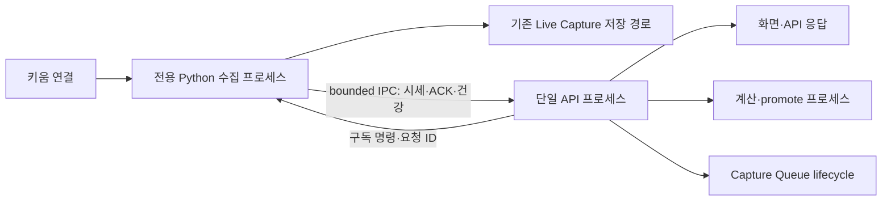

# Python GC 부담·수집 지연·Capture Queue 소유권 개선 계획

작성: 2026-10-02 KST. 상태: P0–P2 로컬 구현·검증 완료, 운영 적용·장중 성능 검증 대기.
P3는 아래 판단 조건에 따른 후속 단계다. 기존 관측 표본은 변경 전 근거다.

**Python을 유지하면서 Capture Queue의 안전한 소유권 복구를 먼저 구현하고, 호가 재구성과 메모리 보관을 줄인 뒤 수집 프로세스 분리를 추진한다.** health 503을 만드는 소유권 문제와 GC 정지는 별개의 문제로 수정·검증한다. 이 문서는 [기존 세션 종료·GC 계획](2026-10-02-kiwoom-session-retirement-and-gc.md)의 후속 계획이며, 기존 문서의 과거 표본과 결론을 대체하지 않는다.

## 1. 확인한 상태와 해결할 문제

| 항목 | 확인한 사실 | 해석·한계 |
|---|---|---|
| health 503 | 22:08:42 표본에서 `dead_tasks=[]`, `queue.owned=false`, `queue.disabled_by_env=false` | 죽은 태스크가 없어도 필수 Capture Queue가 동작할 준비를 갖추지 못한 상태다. 정상 복구로 기록하지 않는다. |
| 소유권 획득 | 시작 시 파일 잠금을 얻지 못하면 manifest 복원과 Capture Queue worker 시작을 건너뛴다. | 이후 기존 소유자가 종료되어도 현재 코드에는 지속적인 소유권 재획득 경로가 없다. |
| 기존 재시도 | `queue-persistence-retry`는 저장 실패를 재시도한다. | 파일 잠금 재획득이나 미시작 worker 복구는 수행하지 않는다. |
| GC 지연 | 이전 재개 구간의 worker PID 462218에서 19:58:59.726 자연 gen1 GC 1189.1ms가 기록됐다. 같은 시각의 loop 정지 1216ms와 호가 복원 경로가 겹쳤다. | 시간 일치는 확인했지만, 특정 버퍼가 전체 지연의 원인이라는 인과 증거는 부족하다. loop 로그에는 PID가 없어 귀속에도 한계가 있다. |
| 반복 호가 복원 | 마지막 호가 flusher는 모든 호가를 dict/list로 복원한 뒤 버전 변경 여부를 비교한다. | 변경이 없는 주기에도 불필요한 객체를 만든다. 전체 JSON 저장도 이벤트 루프에서 동기 실행된다. |
| 메모리 보관 | 버퍼에 시간·종목별 상한은 있지만 전체 종목·종류를 합친 메모리 예산은 없다. | 종목 수, 데이터 종류, 조회·subscriber·캐시 증가에 따른 총량은 별도로 제한해야 한다. |
| 현재 프로세스 분리 | API 밖에 계산용 process pool과 당일 promote용 프로세스가 있다. | 무거운 계산의 분리는 유효하다. 실시간 수신·호가 버퍼·마지막 호가 저장은 여전히 API 인터프리터의 GC 영향을 받을 수 있다. |

22:08 표본의 API worker는 PID 71654, 커밋 `ff0148c55e2f6326bfed50a4258bc44becc785f9`, live 시작은 `1790946018408`이다. PID 462218의 GC 수치와 새 worker의 카운터를 합치지 않는다. 이 표는 작성 근거인 표본이며 계속 정상이라는 보장은 아니다. 당시 공급사 상태는 장외 `paused`, 수집 상태는 `closed`였으므로 새 수신 진행이나 부하 개선을 입증하는 표본도 아니다.

근거: [22:08 평가](</home/dev/.local/share/hoga-ops/diagnostics/kiwoom-session-retirement-monitor-evaluation-20261002-2208.json>), [health 오류 본문·프로세스 증거](</home/dev/.local/share/hoga-ops/diagnostics/kiwoom-session-retirement-restarted-target-evidence-20261002-2208.json>), [시작 로그 증거](</home/dev/.local/share/hoga-ops/diagnostics/kiwoom-session-retirement-restarted-log-evidence-20261002-2208.json>), [GC·알림 이력](</home/dev/.local/share/hoga-ops/diagnostics/kiwoom-session-retirement-monitor-alerts-20261002.json>).

### 서로 다른 큐를 구분한다

- **Capture Queue**: 과거 Stock-Date 데이터를 페이지 단위로 수집하는 작업 큐다. 이번 health 503의 소유권 문제가 여기에 해당한다.
- **실시간 수신 큐**: 키움 연결에서 받은 프레임을 처리하는 큐다. 초과·폐기·대기 시간과 연결 세대를 추적한다.
- **Live Capture 저장 경로**: 실시간 데이터의 기존 저장·다운샘플링·promote 경로다. 표시용 버퍼를 줄여도 이 경로의 저장 계약을 보존한다.

Capture Queue 소유권 복구가 실시간 연결이나 GC 문제까지 해결한다고 설명하지 않는다.

## 2. 구현 순서와 PR 경계

| 순서 | 변경 | 완료 기준 |
|---|---|---|
| P0 | Capture Queue 소유권 재획득·복원·readiness | 기존 소유자가 잠금을 놓으면 서버 재기동 없이 안전하게 복구하고, 두 소유자가 동시에 쓰지 않는다. |
| P1 | 변경 없는 호가 복원 제거·저장 경로 개선 | 같은 버전에서는 전체 호가를 복원하지 않고, 파일 내용과 실패 재시도 계약을 유지한다. |
| P2 | 표시 버퍼·캐시·대기 작업의 전체 보관량 제한 | 총량이 정한 예산 안에 머물며 필요한 저장 데이터와 표시 의미를 보존한다. |
| P3 | 전용 Python 수집 프로세스·bounded IPC | API 프로세스의 GC 중에도 별도 수집 프로세스에서 수신과 필요한 저장이 진행된다. |

각 단계는 별도 PR로 검증한다. P0는 GC 변경 없이 먼저 진행할 수 있다. P1·P2 결과로 P3의 비용 대비 효과를 판단하며, 수집 독립성이 필요한 지연 목표를 충족하지 못하면 P3를 구현한다. P3를 검토하는 동안에도 P0–P2를 미루지 않는다.

## 3. P0 — Capture Queue 소유권 복구

대상: [ownership.py](../../hoga/api/ownership.py), [captures.py](../../hoga/api/captures.py), [app.py](../../hoga/api/app.py). 기존 결정: [ADR-0094](../adr/0094-single-queue-owner-per-data-dir.md).

### 3.1 원인 조사부터 분리한다

시작 로그에는 다른 프로세스의 소유권 힌트가 있지만, 힌트 PID는 현재 커널 잠금 소유자를 증명하지 않는다. 실제 잠금의 device/inode·FD·프로세스 시작 시각·boot ID·data_dir를 읽기 위주로 대조한다. “현재 다른 프로세스가 소유 중”과 “현재 잠금은 풀렸지만 시작 시 실패 상태가 남음”을 구분한다.

잠금 파일 삭제, PID 힌트만 보고 강제 종료, 소유권 검사를 우회하는 환경변수 설정을 복구 수단으로 쓰지 않는다. 특히 파일 삭제 후 새 inode를 만들면 기존 잠금과 분리되어 두 writer가 생길 수 있다. `.queue.lock` 외 collector·WS writer·daily 잠금은 각각 별도 소유권이다.

### 3.2 재획득과 작업 복원을 하나의 lifecycle로 만든다

1. 큐 소유가 필요한 실행 역할만 재획득을 시도한다. 의도적으로 비활성화한 인스턴스는 계속 읽기 전용으로 두고 자동으로 owner가 되지 않는다. 역할은 명시적 설정으로 정의하며 포트 번호나 PID 힌트로 추론하지 않는다.
2. lifespan이 단일 복구 태스크를 소유한다. 실제 비차단 `flock` 획득 실패 뒤 비동기 backoff를 적용한다. 제안값은 1→2→5→30초 상한과 jitter이며, 운영 목표에 맞춰 설정한다. 현재의 동기 `time.sleep` 재시도를 이벤트 루프에 남기지 않는다.
3. 커널 잠금 획득에 성공한 뒤 **최신 manifest**를 읽는다. 복원 성공과 worker 시작까지 확인한 후에만 준비 완료로 표시한다. 소유권 획득 자체와 서비스 준비 완료는 구분한다.
4. 복원은 획득 세대당 한 번만 실행한다. 현재 복원 함수는 리스트에 항목을 추가하므로 그대로 반복 호출하지 않는다. item ID·Stock-Date 중복, cursor, 일시정지 상태, 실패 연속 횟수, 기존 취소 처리 의미를 보존한다.
5. `start_capture_pool()` 전체를 주기적으로 다시 호출하지 않는다. 현재 함수의 epoch·revision 초기화와 worker 생성이 반복되지 않도록 획득·복원·시작을 분리한다.
6. 복원이나 worker 시작이 실패하면 부분 시작 태스크를 정리하고 잠금을 해제한다. 손상된 manifest를 빈 큐로 덮어써 정상처럼 복구하지 않는다. 실패 단계와 재시도 가능 여부를 남긴다.
7. 종료 시 신규 작업 접수·재획득을 중단하고, 실행 작업 정리와 필요한 저장을 끝낸 뒤 잠금을 놓는다. 취소·shutdown과 획득이 경합해도 미채택 FD나 복구 태스크가 남지 않아야 한다.

복구 상태는 `contended → acquiring → restoring → running`과 실패·종료·의도적 비활성화를 구분하도록 설계한다. 태스크 중복과 늦은 이전 세대의 완료가 새 상태를 덮어쓰지 않게 owner epoch를 사용한다. 실행 역할과 상태값은 구현 전 ADR에서 확정한다.

### 3.3 health의 의미와 진단을 보강한다

- 필수 owner가 없거나 복원·worker 시작이 끝나지 않았으면 계속 503이다. `dead_tasks=[]`만으로 200을 반환하지 않는다.
- 큐 소유권, 복원 상태, worker 준비 상태, 마지막 실패 단계, 마지막/다음 재시도 시각을 분리해 노출한다. 잠금 경합과 파일 접근·I/O 오류를 호출 단계와 오류 코드로 구분한다.
- health 메시지는 GC 지연·수신 장애·큐 소유권 장애를 혼동하지 않게 한다. 프로세스 생존과 서비스 readiness를 구분해 restart loop를 유발하지 않도록 운영 검사 사용처도 확인한다.
- 기존 테스트 DI의 `owned=None` 호환 의미를 무조건 운영 `false`로 바꾸지 않는다. 실제 초기화 실패가 이 호환 경로로 빠지지 않는지도 검사한다.
- wire 필드를 추가하면 BE 모델·FE 타입·enum·HTTP 직렬화 검사를 같은 PR에서 수정한다. [API wire 계약 지침](../agents/api-wire-contract.md)을 따른다.

**검증:** 임시 data_dir에서 두 독립 프로세스를 실행한다. A가 owner인 동안 B는 쓰지 못하고, A가 정상 해제된 뒤 B가 재기동 없이 복원·시작해야 한다. 동시에 owner인 구간과 같은 Stock-Date 중복 writer가 없어야 한다. stale PID 힌트, 실제 살아 있는 잠금, 복원 실패, 재시도 중 종료, 획득 직후 취소, reload 인계, 저장 실패를 포함한다. 권한·디스크 오류에서 무한 고속 재시도하거나 상태만 정상으로 바꾸면 실패다.

관련 테스트: [큐 소유권](../../tests/test_api_captures_queue_ownership.py), [health](../../tests/api/test_health_deep.py), [저장 복구](../../tests/api/test_queue_persistence_status.py), [시작 lifecycle](../../tests/api/test_startup_runtime.py).

## 4. P1 — 호가 재구성·저장 할당 줄이기

대상: [buffer.py](../../hoga/live/buffer.py), [lifecycle.py](../../hoga/live/lifecycle.py), [packed_orderbook.py](../../hoga/live/packed_orderbook.py), [last_ob_store.py](../../hoga/live/last_ob_store.py).

### 첫 PR: 변경 없는 주기를 건너뛴다

- 잠금 안에서 buffer instance/epoch와 마지막 호가 버전을 먼저 비교한다. 바뀐 경우에만 저장용 스냅샷을 만들고 잠금 밖에서 복원한다.
- 비교와 스냅샷 취득 사이의 변경을 놓치지 않게 한 동작으로 묶는다. 새 buffer의 버전 숫자가 이전 buffer와 우연히 같아도 저장을 생략하지 않는다.
- 저장 성공 뒤에만 마지막 저장 버전을 전진시킨다. 쓰기 실패 후 같은 버전이라도 재시도한다. 저장 도중 들어온 새 변경은 다음 주기에 남는다.
- 종목 제거도 버전·삭제 기록에 반영한다. 현재 `drop_codes_except()`의 마지막 호가 삭제와 버전 갱신 관계를 회귀 테스트로 확인한다.
- 첫 변경은 기존 전체 스냅샷·파일 형식을 유지한다. 값·venue·타임스탬프·선택 필드·알 수 없는 payload의 보존을 검증한다.

### 후속 PR: 변경분 복원과 저장 I/O를 줄인다

측정 결과 필요하면 단일 저장 소유자가 dirty 항목과 삭제 기록을 기존 캐시에 병합하고 완성된 전체 파일을 원자적으로 저장한다. **변경분만 기존 `save()`에 전달하지 않는다.** 기존 함수는 전체 스냅샷 저장 계약이므로 다른 종목을 잃을 수 있다. 빈 입력은 기존 파일을 유지하는 의미도 별도 검토한다.

동기 파일 I/O는 이벤트 루프 밖으로 이동하되 저장 순서를 직렬화하고 종료 시 완료·실패를 확인한다. thread 이동은 파일 대기를 줄일 수 있지만 같은 Python 인터프리터의 GC 격리를 제공하지 않는다. JSON 직렬화의 CPU·할당이 문제면 별도 프로세스 전달 방식까지 측정한 뒤 선택한다. 읽는 동안 입력이 바뀌어 혼합 스냅샷이 만들어지지 않도록 immutable 값과 명시적 복사 경계를 유지한다.

**검증:** 변경 없는 주기, 변경·삭제·재추가, 새 buffer, 저장 중 갱신, 파일 쓰기 실패·재시도, 종료와 저장 경합을 검사한다. 기존 파일을 읽었을 때 모든 Code/venue의 값이 기준 구현과 같아야 한다. 전체 복원 횟수·저장 바이트·할당량·loop 지연을 같은 입력으로 비교한다.

관련 테스트: [마지막 호가 저장](../../tests/unit/live/test_last_ob_persistence.py), [buffer](../../tests/unit/live/test_buffer.py), [packed 호가](../../tests/unit/live/test_packed_orderbook.py), [오프라인 벤치마크](../../tests/tools/test_bench_live_buffer.py).

## 5. P2 — 전체 보관량과 대기 작업 제한

표시용 버퍼, 마지막 호가 sidecar, 초봉·조회 캐시, subscriber 큐, 대기 요청을 각각 계측한다. 기존 시간·항목 상한을 유지하면서 전체 항목·바이트 예산과 만료 규칙을 추가한다. 정확한 Python 객체 크기를 운영 힙 순회로 계산하지 않고, 구조별 카운터·보수적 크기 추정·RSS를 대조한다.

구현 전 다음 정책을 문서와 설정으로 확정한다.

- 표시 이력의 최소 보장 시간·항목 수, 활성 종목 우선순위, 전체 예산 초과 시 제거 순서. 이력이 짧아졌다면 UI가 그 사실을 확인할 수 있어야 한다.
- 마지막 호가의 Code/venue별 최신값과 날짜 전환 의미. 장외·다음 날에도 필요한 마지막 호가를 일괄 삭제하지 않는다.
- 저장 완료 전 데이터의 보호와 표시 이력의 제거를 분리한다. 표시 캐시를 줄였다고 필요한 Live Capture 파일이나 복구 cursor를 삭제하지 않는다.
- compute pool의 실행 slot과 **대기 중 요청 수**를 별도로 제한한다. 대기열 초과 시 명시적 거부·취소·시간 제한 정책을 두며 조용히 데이터나 작업을 버리지 않는다.
- 부모와 계산·promote·수집 자식의 총 메모리·CPU 예산을 함께 정한다. 자식 수를 늘린 만큼 메모리와 DB thread가 늘어나는 효과를 반영한다.

작은 최신값 캐시와 bounded 표시 버퍼는 남기되, 버퍼를 무조건 크게 만들어 지연을 숨기지 않는다. 실제 필요 보관 시간과 호스트 가용 메모리를 측정한 뒤 기본 예산을 정한다.

**검증:** 종목 증가·해제·재등록, venue 변경, 이력 포화, subscriber 지연·해제, 날짜 전환, 계산 요청 폭주를 오프라인으로 재현한다. 예산 도달 후 RSS·항목 수가 안정화되고 저장 결과가 기준 구현과 같아야 한다. 제거·거부·표시용 병합 수치를 명시적으로 집계한다.

## 6. P3 — Python 수집 프로세스 분리

현재의 계산·promote 프로세스 분리는 유지한다. API는 한 Uvicorn worker로 두고, **실시간 연결과 필수 저장을 단독 소유하는 수집 프로세스 하나**를 추가하는 구조를 설계한다. 계정 6개가 곧 프로세스 6개라는 뜻은 아니다. [ADR-0116](../adr/0116-kiwoom-ws-parallel-broker.md), [ADR-0168](../adr/0168-today-promoter-dedicated-worker-process.md), [ADR-0169](../adr/0169-request-path-compute-worker-pools.md)의 소유권·작업 분리 결정과 충돌·확장되는 부분을 ADR에 기록한다. 새 ADR 번호는 구현 시 저장소와 열린 PR을 확인한 뒤 정한다.

그림의 Capture Queue는 P0에서 다루는 과거 수집 작업이다. 전용 실시간 수집 프로세스의 프레임 큐와 합치지 않는다. promote 작업의 기존 프로세스 경계는 유지하되 새 저장 소유자와의 요청·완료 인계를 정의한다.

### 경계와 장애 계약

- 수집 자식은 vendor 연결·세션 세대·ACK·수신 큐·필수 LiveWriter 입력을 책임진다. API는 원하는 구독 집합과 화면·조회·계산 요청을 책임진다. 토큰 갱신, REST 제한, 파일 writer 잠금의 소유자도 구현 전에 하나로 정한다.
- `spawn`을 사용하고 수집 자식이 FastAPI 앱 전체를 import·초기화하지 않게 한다. API의 GC와 수집 자식의 GC를 별도 계측한다. 자식 자체의 GC는 남으며 공유 CPU·RAM·디스크 경합도 남는다.
- IPC는 메시지 수와 바이트 모두 제한한다. child epoch, session generation, sequence, 요청 ID를 사용해 늦은 ACK·중복 명령·순서 누락·재시작을 판별한다. 같은 desired 구독 버전의 확인 범위만 ready로 표시한다.
- 화면용 최신 호가는 Code/venue별 병합을 허용할 수 있지만 정책과 횟수를 드러낸다. 거래 순서, 저장 필수 입력, 제어 ACK를 같은 방식으로 병합하지 않는다.
- API가 느려도 수집·필수 저장이 화면 IPC를 기다리며 함께 막히지 않게 한다. 지속적인 저장 불능이나 용량 초과에는 명시적 실패·손실 집계·복구 정책을 둔다. 유한 큐로 무한 부하의 무손실을 보장한다고 주장하지 않는다.
- parent 종료·고아 자식·자식 실패·재시작에서 중복 vendor 연결과 중복 writer를 막는다. 이전 세션 종료와 소유권 해제가 확인된 뒤 새 자식을 활성화한다. IPC epoch만으로 실제 소켓 소유권을 대신하지 않는다.
- 큐 소유권 장애나 API readiness 503이 수집 자식을 자동으로 반복 재시작하지 않도록 장애 범위를 분리한다. parent의 화면이 멈춰도 수집이 계속될 수 있지만 화면 지연 자체까지 없어지는 것은 아니다.

**검증:** 공급사 연결 없이 녹화 입력·가짜 peer·loopback IPC로 기준 구현과 저장·순서·ACK 결과를 비교한다. API 측 지연, 느린 IPC 소비자, IPC 단절, 자식 비정상 종료, parent 종료, 구독 변경 중 재시작을 주입한다. 오래된 자식의 결과가 새 세대에 적용되거나 두 writer가 동시에 쓰면 실패다. 운영 서버에 고의 GC·timeout·끊김을 유발하지 않는다.

## 7. 성능 검증과 완료 기준

다음 숫자는 **제안 목표이며 현재 달성 결과가 아니다.** 구현 전 같은 입력의 기준값과 제품 요구를 확인해 확정한다.

| 지표 | 제안 기준 |
|---|---|
| P0 자동 인계 | 기존 owner의 실제 잠금 해제 후 backoff 상한 30초 안에 다음 획득 시도. 준비 완료 시간은 획득 대기와 manifest 복원·worker 시작 시간을 나누어 측정한다. |
| 정상 수신 처리 | 수신→callback 완료 p99 50ms 이하를 초기 목표로 검토한다. 프레임 크기·계정·표본 수를 함께 기록한다. |
| loop 지연 | p99 50ms 이하, 250ms 초과 조사, 새 1초 이상 정지는 회귀 판단 대상으로 둔다. 최대값은 전체 관측 기간과 rolling 표본을 구분한다. |
| 데이터 정확성 | 정상 구간에 설명되지 않는 누락·중복·순서 오류 0. 큐 초과·폐기와 의도한 화면 병합은 별도 집계한다. |
| 메모리 | 정한 전체 예산 안에서 이력 포화 후 안정화. 다른 프로세스·호스트 메모리 압박을 함께 확인한다. |
| GC | 자연 gen0/1/2의 횟수·최대·최근 시간과 수신/완료 진행을 같은 프로세스 구간에서 비교한다. 자연 gen2 미관측이면 해당 동작은 검증 미완료다. |

GC 프로브의 elapsed는 벽시계 시간이다. CPU 시간이나 전체 순회 객체 수를 뜻하지 않는다. 회수 객체 수가 적다는 이유만으로 누수·특정 버퍼 원인을 확정하지 않는다. GC threshold를 올리거나 GC를 끄는 것은 선행 개선으로 쓰지 않는다.

오프라인 비교는 같은 녹화 입력, 종목·venue·타입, 이력 길이, API 조회, 기존 저장·promote 부하를 맞춘다. packed 호가 단독 합성 실험의 개선을 전체 운영 결과로 확대하지 않는다. 수신 프레임·raw 행·완료 틱은 서로 다른 단위다. 수신→처리 시간은 거래소부터의 종단 지연이 아니다.

운영 검증은 별도 적용 뒤 정규장 실제 수신과 이력 포화 이후를 포함해 최소 60분 수행한다. 계정별 수신·완료 증가, expected/acked, 등록 준비, 큐 손실, 저장 결과를 함께 확인한다. 장외 낮은 부하, 재기동으로 초기화된 카운터, `capture_healthy` 단독 값으로 완료를 선언하지 않는다. timeout·재연결·자연 gen2가 없었으면 그 경로의 검증 한계를 보고한다.

각 구현 PR은 변경 경로의 의미 있는 테스트와 필수 `uv run --extra dev ruff check .`, `uv run --extra dev pytest -q -m 'not wallclock'`를 통과시킨다. wire 변경 시 계약 검사와 관련 프론트 검증을 추가한다.

## 8. 부작용·롤백

| 변경 | 가능한 부작용 | 예방·롤백 기준 |
|---|---|---|
| 소유권 자동 복구 | 늦은 인계, 중복 복원·worker, 종료와 획득 경합 | 역할 제한·실제 flock·세대별 1회 복원·단일 복구 태스크. 실패 시 503을 유지하고 파일을 보존한다. |
| 호가 복원 생략 | 갱신·삭제 누락, 저장 실패 뒤 재시도 누락 | instance/epoch·변경/삭제 버전·성공 후 전진. 기존 전체 스냅샷 방식으로 되돌릴 수 있게 파일 호환을 유지한다. |
| 메모리 상한 | 화면 이력 감소, 캐시 miss·추가 조회, 작업 거부 | 최소 표시 계약·계측·명시적 상태. 저장 필수 입력을 제거해 상한을 맞추지 않는다. |
| 수집 프로세스 분리 | IPC 비용·복사·메모리 증가, 제어·종료 복잡성 | bounded 전달·적은 객체 복원·동일 입력 비교. 전환 플래그와 단일 소유 인계 절차를 마련한다. |

롤백에서도 새 수집 자식과 writer가 종료·잠금 해제된 것을 확인한 후 이전 소유자를 시작한다. 두 구현을 같은 공급사 연결·data_dir writer에 동시에 활성화하지 않는다. 잠금 파일 삭제, 큐 증설, GC 비활성화로 문제를 감추는 롤백은 하지 않는다.

## 9. 이번 작업 범위와 다음 실행

사용자 구현 요청에 따라 이 워크트리에서 P0–P2를 구현했고, 이어 P3도 즉시 구현하도록
요청받아 [ADR-0174](../adr/0174-dedicated-python-live-capture-process.md)의 수집 프로세스를 추가했다. 운영 서버·8001 서버와
main checkout의 사용자 변경 파일에는 적용하지 않았다. 큐 소유권의 실운영 복구나
GC 문제 해결을 로컬 검증만으로 선언하지 않는다.

| 단계 | 이번 구현 | 근거·남은 범위 |
|---|---|---|
| P0 | 단일 소유권 복구 supervisor, 비동기 backoff, strict manifest 복원, 준비 전 503, shutdown 저장 후 잠금 해제 | 실제 별도 프로세스 flock 인계 및 HTTP 직렬화 검증. 기존 PID 힌트만으로 잠금 소유자를 확정하지 않는다. |
| P1 | instance/version 선비교, 변경 없는 복원 생략, 종목 삭제 저장, 직렬 off-loop 저장·실패 재시도·종료 대기 | 파일 형식 유지. thread 이동은 GC 격리가 아니다. dirty 부분 병합 저장은 추가하지 않았다. |
| P2 | 표시 버퍼 전체 항목/추정 byte 상한, cold stream 우선 FIFO, TTL 캐시 전체 LRU 예산, pool별 사용자 입장 상한 | disk capture와 최신 호가 보존. 축소 이력은 API 및 화면에서 명시. 기존 초봉·조회 cache·outbox 상한 유지. |
| P3 | 전용 spawn 수집 프로세스, 세 lane bounded IPC, child writer lock·완료 후 인계, 조회 proxy·health | 사용자의 최신 즉시 구현 요청을 반영했다. 오프라인 동일 입력/저장 비교와 장애 검증을 수행하며 실제 정규장 p99·합산 RSS 검증은 별도로 남는다. |

### 적용 예산과 관측

- 표시 이력: 기본 250,000개 / 추정 payload 512MiB.
  `HOGA_LIVE_BUFFER_MAX_ENTRIES`, `HOGA_LIVE_BUFFER_MAX_BYTES`로 조절한다.
  최소 시간 창은 평소 계약이고 예산 포화 시 예외가 적용된다. 조회 subscriber 없는
  stream을 먼저, 다음은 가장 오래전에 publish한 stream에서 FIFO로 줄인다.
- Code×venue 최신 호가와 LiveWriter 저장 입력은 이 표시 예산에서 제외한다.
  byte 추정은 알려진 container·값에 대한 계측으로, allocator·metadata·sidecar·
  일시 작업·opaque 객체 내부를 합친 RSS 상한이 아니다.
- 오늘 지표 TTL cache: 기본 512개 / 추정 값 128MiB. 만료와 LRU로 줄이고,
  예산보다 큰 값은 보관하지 않는다. cache miss와 재계산 비용이 늘 수 있다.
- compute: wide/narrow 풀별 기본 128개 outstanding 사용자 요청.
  `HOGA_COMPUTE_MAX_PENDING_REQUESTS`로 조절한다. `/range`의 모드 gate 대기부터
  집계하고, 초과 시 `compute_capacity_exceeded` 503을 반환한다. 캡처 lifecycle의
  저장 작업은 이 사용자 입장 거부 정책에서 제외한다.
- `/health?deep=1.queue`는 잠금 보유와 준비 완료, 시도/복원/시작/실패 상태를 구분한다.
  `compute.wide/narrow`는 현재 요청·상한·거부 수를 노출한다.
  `/api/live/status.cache_stats.live_buffer`와 `today_ttl`은 점유·상한·축출 수를 제공한다.
- 기존 메모리 제한을 유지한 범위: 초봉 store cell 예산, 초봉 역사 LRU(4개)와 저장 읽기
  LRU(8개), 과거 캔들 전체/per-code bar 예산, 당일 캔들 cache(256개), 지표 LRU,
  subscriber/outbox의 기존 유한 전달 예산. 이것만으로 부모와 자식의 전체 RSS 상한을
  보장하지 않으며 §7의 합산 메모리·장중 검증은 남는다.

### 로컬 검증 결과

- Ruff 통과. backend 전체 `not wallclock`: 5,355 통과, 2 skipped, 13 deselected.
- frontend typecheck 및 Vite build 통과. Vitest: 600개 파일 / 7,703개 테스트 통과.
- Playwright 전체 148개 통과. 이력 축소 안내 추가 후 관련 smoke 3개도 통과.
- 큐 신규 디렉터리·잠금 인계·손상·복원 취소·worker 시작 실패·종료 저장,
  호가 무변경·삭제·저장 실패 재시도·진행 저장 종료 경합, cache/버퍼 포화,
  계산 실행 취소·모드 gate 대기 중 과부하, 모듈 생성 후 로드된 환경 설정의
  표시 보관 상한 적용을 검증했다.
- [재현 도구](../../tools/bench_gc_capture_limits.py)와
  [합성 재생 결과](../diagnostics/2026-10-02-gc-capture-limits/offline-replay.json):
  328종목 × 10호가의 무변경 조회 100회에서 이전 선복원 방식 547.8ms / traced peak
  2,855,648B, 선비교 방식 0.117ms / 704B였다. 같은 packed 표현 위에서 읽기 순서만
  비교한 결과이며 전체 이전 릴리스·디스크 저장·운영 GC 비교가 아니다.
- 328종목 × 100틱, 테스트 예산 4,096개 / 8MiB 재생은 byte 예산이 먼저 적용되어
  2,814개 / 추정 8,388,534B에서 안정화됐다. 최신 호가 328개는 유지했고
  표시 이력 축출은 29,986개였다. 마지막 표본 RSS 약 52.1MiB는 이 작은 OB-only
  재생 프로세스의 값으로, 운영 기본 예산이나 다른 작업의 메모리 성능을 입증하지 않는다.

장중 실제 수신·저장/promote 부하, 자연 gen2, 수신→완료 및 loop p99, 합산 RSS는 아직
이번 코드로 검증하지 않았다. §7 운영 검증은 유지하며 P3 도입 판단은 사용자의
최신 요청으로 확정됐다. 운영 적용 여부와 성능 완료 판정은 별도다.

기존 `gc` 관측은 사용자가 정한 2026-10-02 23:59 KST 종료 조건을 유지한다. 기존 보고서를 보존하고 종료 시 재개 보고서를 별도 저장한다. 이번 계획은 관측을 다음 날짜로 연장하거나 운영 제어·새 공급사 연결을 허가하는 내용이 아니다.

### P3 구현 및 검증 (2026-10-03)

API와 수집을 나누되 token/REST 소유자는 유지했다. 기본 process/롤백 inprocess,
저장 경로·venue 형식 유지, 화면 gap의 명시, 자식 GC와 10초 freshness, 종료 확인 후
재기동 정책 및 강제 종료의 부분 데이터 손실 한계는 ADR-0174에 기록했다.

- Ruff 및 `git diff --check` 통과. backend 전체 `not wallclock`: 5,377 통과,
  2 skipped, 13 deselected.
- frontend typecheck·Vite build 통과. Vitest: 600개 파일 / 7,703개 테스트 통과.
  Playwright 전체 149개 통과.
- 수집 프로세스 관련 18개 테스트에서 실제 spawn, 동일 합성 입력의 저장 결과 일치,
  API loop 정지 중 자식 저장 진행, 표시 IPC 포화, 취소된 RPC의 늦은 응답,
  강제 종료 후 새 epoch 및 구독 복구, 부모 비정상 종료 후 자식 종료와 flock 인계,
  종료 시 저장 완료, HTTP health·초봉 조회 계약을 검증했다.
- 실제 production entry도 임시 데이터·로그 디렉터리와 계정 0개로 실행해 준비 완료,
  자식 GC 계측, 조회 RPC와 정상 종료를 확인했다. 토큰이나 공급사 연결은 사용하지 않았다.

운영 포트·공급사 연결은 조작하지 않았고 배포하지 않았다. 자식의 GC 정지는 여전히
발생할 수 있다. 실제 정규장 수신→저장 p99, 두 프로세스의 합산 RSS 및 운영 큐 소유권
복구는 이 오프라인 검증으로 완료 판정하지 않는다.
